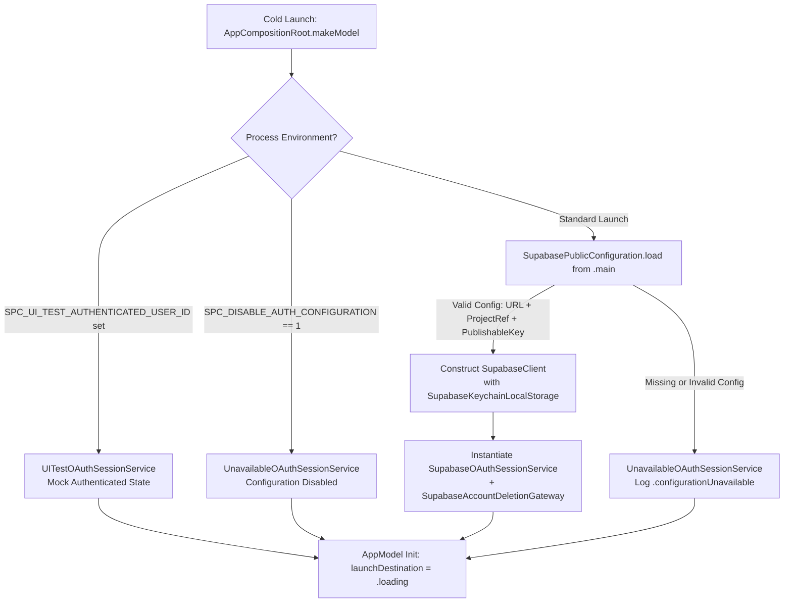
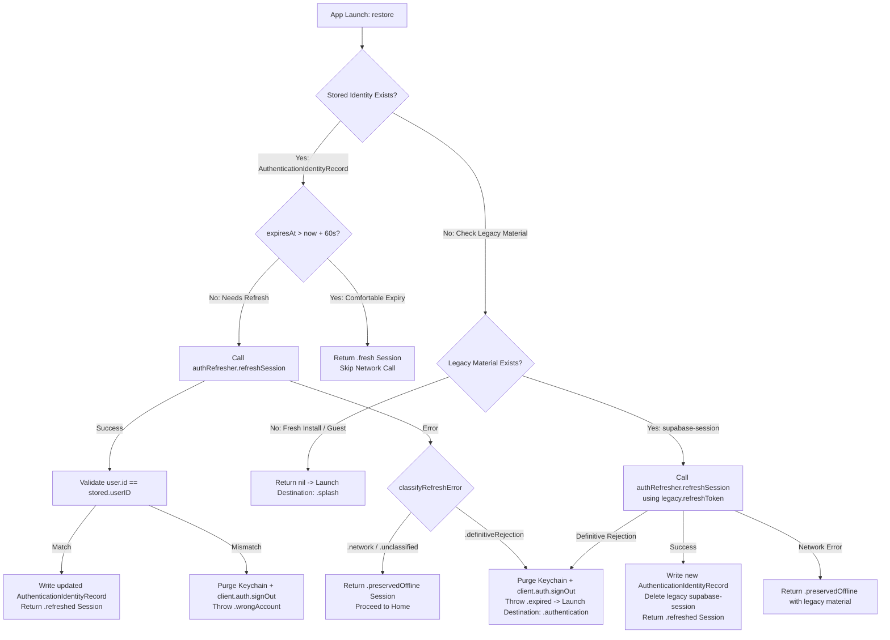

# Sleep Paralysis Companion — Sign-In Flow & Authentication Architecture

**Document status:** Authoritative technical specification and operating guide  
**Scope:** Authentication lifecycle, session restoration, secrets management, error taxonomy, and data rights  
**Last reviewed:** 01 September 2026 (Sign-In Hardening S7 end-state)

---

## 1. Executive Summary & Architecture Consolidation Verdict

Sleep Paralysis Companion operates on a privacy-first, nonmedical wellness contract where all cloud-backed synchronization is optional and authenticated strictly through **Apple** and **Google** identity providers.

### 1.1 Dual-Stack Reconciliation Verdict (Option A)

The codebase contains two specialized authentication subsystems created across development phases:

| Dimension | Stack A: Native ID-Token & Deletion Foundation | Stack B: SDK-Managed Web OAuth Session Service |
|---|---|---|
| **Primary Types** | `AuthenticationCoordinator`, `OAuthChallengeFactory`, `AuthenticationGateway`, `NativeIdentityCredential`, `SignOutCoordinator`, `SupabaseAuthenticationGateway` | `SupabaseOAuthSessionService`, `DefaultSupabaseOAuthAuthenticator`, `DefaultSupabaseAuthRefresher`, `SupabaseKeychainLocalStorage`, `OAuthSessionServicing` |
| **Origin** | Phase 1B Hand-hardened Native ID-Token Foundation | Phase 1 / Sign-In Hardening (S1–S6) Production Web OAuth Flow |
| **Interactive UX** | Designed for native ASAuthorizationController / OpenID Connect ID-Token exchange via `signInWithIdToken` | Implemented via `ASWebAuthenticationSession` browser sheet delegating to `supabase-swift` (`signInWithOAuth`) |
| **Live Consumers** | `SignOutCoordinator` ([`DeletionFoundation.swift:73-111`](file:///c:/Users/satya/Documents/paralux/ios/Sources/DataRights/DeletionFoundation.swift#L73-L111)), tested in [`DataRightsFoundationTests.swift:470-500`](file:///c:/Users/satya/Documents/paralux/ios/Tests/Unit/DataRightsFoundationTests.swift#L470-L500) and [`AuthenticationFoundationTests.swift`](file:///c:/Users/satya/Documents/paralux/ios/Tests/Unit/AuthenticationFoundationTests.swift) | Wired via [`AppCompositionRoot.swift:41,69`](file:///c:/Users/satya/Documents/paralux/ios/Sources/App/AppCompositionRoot.swift#L41) into [`AppModel.swift:89`](file:///c:/Users/satya/Documents/paralux/ios/Sources/App/AppModel.swift#L89), driving live Sign-in ([`FigmaAuthenticationView.swift`](file:///c:/Users/satya/Documents/paralux/ios/Sources/Features/Onboarding/FigmaAuthenticationView.swift)), launch restoration, and sensitive account deletion reauthentication |
| **Invariant Ownership** | • Client-generated cryptographic PKCE + state + raw/hashed nonces<br>• `expectedFormerUserID` validation on token exchange<br>• Explicit provider-grant revocation on sign-out | • SDK-delegated PKCE and browser redirect handling<br>• Offline-tolerant launch session restoration (S1)<br>• Unified error taxonomy & privacy-safe logging (S2)<br>• SDK-owned token storage & single sanctioned identity record (S4) |

**Verdict:** Both stacks are retained with strictly delineated responsibilities:
1. **Production Sign-In, Session Restore & UI Workflows** delegate directly to **Stack B** (`SupabaseOAuthSessionService`). This avoids re-implementing OAuth 2.0 PKCE browser redirection protocols while preserving strict iOS app boundaries.
2. **Data-Rights, Deletion Foundation & Cryptographic Nonce Protocols** retain **Stack A** (`AuthenticationCoordinator`, `SignOutCoordinator`, `OAuthChallengeFactory`). Stack A serves as the architectural foundation for native OpenID Connect identity exchange, provider grant revocation, and account-transition safety verification.

---

## 2. Component Inventory & Responsibilities

```
ios/Sources/
├── App/
│   ├── AppCompositionRoot.swift         # Composition factory, env flags, client wiring
│   └── AppModel.swift                   # UI state coordinator, auth actions, route transitions
├── Authentication/
│   ├── AuthenticationFoundation.swift   # Stack A Coordinator, challenges, identity records, errors
│   ├── KeychainSessionStore.swift       # Sanctioned storage: Supabase Auth bridge + App Identity store
│   ├── OAuthSessionService.swift        # Stack B Live service: restore, signIn, reauthenticate, logging
│   └── SupabaseAuthenticationGateway.swift # Stack A Gateway implementation for native OpenID Connect
├── Configuration/
│   ├── AppConfiguration.swift           # Build configuration & runtime flags
│   ├── LegalSupport.swift               # Terms, Privacy Policy, and medical disclaimer copy
│   └── SupabasePublicConfiguration.swift# Validated Supabase URL, projectRef, and publishable key loader
├── DataRights/
│   ├── DeletionFoundation.swift         # SignOutCoordinator, AccountDeletionCoordinator, LocalDeletion
│   └── SupabaseAccountDeletionGateway.swift # Remote Edge Function account-deletion RPC gateway
└── Features/Onboarding/
    └── FigmaAuthenticationView.swift    # SwiftUI sign-in & create-account presentation surface
```

### Responsibility Matrix

- **`SupabaseOAuthSessionService`** ([`OAuthSessionService.swift:136`](file:///c:/Users/satya/Documents/paralux/ios/Sources/Authentication/OAuthSessionService.swift#L136)):
  - Manages interactive sign-in via `signInWithOAuth(provider:)`.
  - Performs offline-tolerant session restoration with 60-second clock skew tolerance.
  - Classifies refresh and sign-in errors into deterministic failure taxonomy buckets.
  - Emits privacy-safe structured logs without PII or sensitive tokens.
  - Manages reauthentication flows required for sensitive account deletion.
- **`KeychainSessionStore`** ([`KeychainSessionStore.swift:105`](file:///c:/Users/satya/Documents/paralux/ios/Sources/Authentication/KeychainSessionStore.swift#L105)):
  - Stores non-secret `AuthenticationIdentityRecord` under service `app.sleepcompanion.spc.authentication` and account `supabase-identity`.
  - Executes one-time migration to clean up legacy secret-bearing `supabase-session` entries.
- **`SupabaseKeychainLocalStorage`** ([`KeychainSessionStore.swift:61`](file:///c:/Users/satya/Documents/paralux/ios/Sources/Authentication/KeychainSessionStore.swift#L61)):
  - Conforms to Supabase's `AuthLocalStorage` protocol.
  - Stores sensitive OAuth tokens (`access_token`, `refresh_token`) under a project-scoped Keychain service: `<bundleID>.supabase.auth.<projectRef>`.
- **`AuthenticationCoordinator`** ([`AuthenticationFoundation.swift:195`](file:///c:/Users/satya/Documents/paralux/ios/Sources/Authentication/AuthenticationFoundation.swift#L195)):
  - Generates cryptographically secure random state, nonces, and PKCE verifiers (`OAuthChallengeFactory`).
  - Enforces `expectedFormerUserID` check to prevent linking mismatched accounts.
  - Coordinates provider grant revocations (Apple authorization codes, Google access tokens).
- **`AccountDeletionCoordinator`** ([`DeletionFoundation.swift:143`](file:///c:/Users/satya/Documents/paralux/ios/Sources/DataRights/DeletionFoundation.swift#L143)):
  - Coordinates two-phase remote account deletion via backend RPC gateway and local data erasure.
  - Enforces recent reauthentication proof (`RecentReauthentication`, max age 5 minutes).

---

## 3. Launch Composition & Configuration Decision Tree

`AppCompositionRoot.makeModel()` ([`AppCompositionRoot.swift:5-119`](file:///c:/Users/satya/Documents/paralux/ios/Sources/App/AppCompositionRoot.swift#L5-L119)) constructs the application graph at cold launch using a fail-closed strategy:



### Fail-Closed Configuration Contract

1. **Configuration Loading** ([`SupabasePublicConfiguration.swift:20-56`](file:///c:/Users/satya/Documents/paralux/ios/Sources/Configuration/SupabasePublicConfiguration.swift#L20-L56)):
   - Verifies HTTPS scheme and host prefix matching pinned URL format (`https://<projectRef>.supabase.co`).
   - Validates that `SPC_SUPABASE_PUBLISHABLE_KEY` is present and formatted with `sb_publishable_` prefix (minimum length 20).
   - Validates that `SPC_OAUTH_REDIRECT_URL` parses to a valid URL matching scheme `spc://` with a non-empty host (e.g., `spc://auth/callback`).
2. **Missing Configuration Fallback**:
   - If configuration is missing or malformed, the app resolves `authentication` to `UnavailableOAuthSessionService` ([`OAuthSessionService.swift:27-43`](file:///c:/Users/satya/Documents/paralux/ios/Sources/Authentication/OAuthSessionService.swift#L27-L43)).
   - Attempting sign-in immediately sets `authenticationState = .configurationRequired` with the user-facing message: *"Provider sign-in will be available once configuration is complete."*
   - Release archives are protected at build time via `scripts/auth_config_preflight.sh` (S6).

---

## 4. Storage Inventory at Rest (Post-S4 Architecture)

Following Sign-In Hardening S4, duplicate token persistence has been eliminated. Exactly **one** sanctioned Keychain item stores cryptographic credentials, while the app maintains a separate non-secret identity record:

| Storage Location | Item Key / Service | Stored Payload | Sensitivity | Owner |
|---|---|---|---|---|
| **iOS Keychain (SDK Bridge)** | Service: `app.sleepcompanion.spc.supabase.auth.<projectRef>`<br>Account: `supabase.session` | JSON dictionary containing `access_token`, `refresh_token`, `expires_at`, `user` object | 🔴 High (Secret Credentials) | `SupabaseKeychainLocalStorage` (`supabase-swift` AuthClient) |
| **iOS Keychain (App Store)** | Service: `app.sleepcompanion.spc.authentication`<br>Account: `supabase-identity` | JSON: `AuthenticationIdentityRecord`<br>• `userID: UUID`<br>• `provider: AuthenticationProvider`<br>• `expiresAt: Date` | 🟢 Low (Non-secret metadata) | `KeychainSessionStore` (`AppModel` / `OAuthSessionService`) |
| **iOS Keychain (Legacy - Deleted on migration)** | Service: `app.sleepcompanion.spc.authentication`<br>Account: `supabase-session` | Legacy JSON: `AuthenticationSessionMaterial` (containing tokens) | 🔴 High (Deprecated) | Migrated and deleted by `KeychainSessionStore.deleteLegacyMaterial()` |
| **SQLite (GRDB)** | `local_profiles` table | `profileID`, `ownership`, `accountUserID`, `accountLinkState`, `updatedAt` | 🟡 Internal Profile Metadata | `LocalDatabase` |

### Keychain Access Attributes
All Keychain records written by `SystemKeychainClient` enforce:
- `kSecAttrAccessible = kSecAttrAccessibleWhenUnlockedThisDeviceOnly`
- Items are strictly excluded from iCloud Keychain backup and device migrations.

---

## 5. Launch Restoration Strategy (Offline-Tolerant S1 & Migration S4)

On cold launch, `AppModel.activate()` calls `authentication.restore()` ([`OAuthSessionService.swift:162-281`](file:///c:/Users/satya/Documents/paralux/ios/Sources/Authentication/OAuthSessionService.swift#L162-L281)):



### Refresh Error Classification Matrix (S1)

| Error Domain / Pattern | Classification | Action Taken | User Impact |
|---|---|---|---|
| `URLError` (any code), `NSURLErrorDomain`, `kCFErrorDomainCFNetwork`, `NSPOSIXErrorDomain` (ECONNREFUSED, ECONNRESET, ENETDOWN, ENETUNREACH, EHOSTUNREACH, ETIMEDOUT, ENOTCONN) | `.network` | **Preserve stored session.** Return `.preservedOffline`. | App launches normally into Home. Local data accessible offline. |
| HTTP 401, 403, 400 or keywords: `invalid_grant`, `invalid_request`, `invalid_token`, `invalid refresh token`, `refresh_token_not_found`, `session_not_found`, `user_not_found`, `jwt expired`, `bad_jwt`, `revoked` | `.definitiveRejection` | **Purge Keychain & SDK session.** Log `.restorePurgedOnRejection`. Throw `AuthenticationError.expired`. | Routes to `.authentication` screen with banner: *"Your session ended. Choose a provider to continue."* |
| HTTP 429, 5xx, or unrecognized decode errors | `.unclassified` | **Preserve stored session (Fail-Safe).** Return `.preservedOffline`. | Preserves local data access during transient server disruptions. |

---

## 6. Interactive Web OAuth Sign-In Flow

Interactive authentication uses `supabase-swift`'s `signInWithOAuth(provider:)`, which launches an in-app browser sheet via Apple's `ASWebAuthenticationSession`:

```
User -> FigmaAuthenticationView: Taps "Continue with Apple" or "Continue with Google"
FigmaAuthenticationView -> AppModel: signIn(provider: .apple / .google)
AppModel -> SupabaseOAuthSessionService: signIn(provider:)
SupabaseOAuthSessionService -> SupabaseClient: client.auth.signInWithOAuth(provider:)
SupabaseClient -> ASWebAuthenticationSession: Opens OAuth Provider Authorization URL
ASWebAuthenticationSession -> Provider: User authenticates with Apple / Google
Provider -> ASWebAuthenticationSession: Redirects to spc://auth/callback?code=...
ASWebAuthenticationSession -> SupabaseClient: Completes session exchange (PKCE)
SupabaseClient -> SupabaseKeychainLocalStorage: Persists tokens in SDK Keychain store
SupabaseClient --> SupabaseOAuthSessionService: Returns Session (user.id, accessToken, expiresAt)
SupabaseOAuthSessionService -> KeychainSessionStore: Writes AuthenticationIdentityRecord
SupabaseOAuthSessionService --> AppModel: Returns AuthenticationSessionMaterial
AppModel -> LocalDatabase: resume(session:) activates authenticated profile
AppModel -> FigmaAuthenticationView: Transitions launchDestination -> .question or .home
```

### OAuth Callback URL Handling (`spc://auth/callback`)
- The OAuth redirect URL is configured as `spc://auth/callback`.
- `ASWebAuthenticationSession` intercepts this URL scheme directly to finish the authentication handshake.
- If an auth callback URL reaches `AppModel.openDeepLink(_:)` ([`AppModel.swift:1295-1311`](file:///c:/Users/satya/Documents/paralux/ios/Sources/App/AppModel.swift#L1295-L1311)), it is safely ignored by `deepLinkResolver.route(for:)`. It produces **no** navigation changes, no error banners, and no state mutations (verified in `NavigationStateTests.testOAuthCallbackDeepLinkProducesNoNavigationOrFeedback`).

---

## 7. Failure Taxonomy, User Copy & Privacy-Safe Logging (S2)

When an error occurs during interactive sign-in, `SupabaseOAuthSessionService.classifySignInError(_:)` maps low-level errors into standard `AuthenticationError` cases. `AppModel.signIn` translates these into calming user-facing copy, while `ApplePrivacySafeLogger` records non-sensitive diagnostic events:

| Failure Origin | `AuthenticationError` Case | User Feedback Message (`AppModel.feedbackMessage`) | Privacy-Safe Log Event (`Category: .authentication`) |
|---|---|---|---|
| User taps "Cancel" in `ASWebAuthenticationSession` or `CancellationError` | `.cancelled` | *None (Quiet dismissal)* | *No log record (Suppressed to prevent log noise)* |
| `URLError`, `NSURLErrorDomain`, `CFNetwork`, `POSIX` transport errors | `.networkUnavailable` | *"Network connection is unavailable. Check your connection and try again."* | `.signInNetworkUnavailable` |
| HTTP 400..499, `invalid_grant`, `access_denied`, `unauthorized`, `bad_oauth_callback` | `.serverRejected` | *"Sign-in was rejected by the server. Try again later."* | `.signInServerRejected` |
| `ASWebAuthenticationSessionError.presentationContextNotProvided` / `.presentationContextInvalid`, 5xx errors | `.externalProviderUnavailable` | *"Sign-in did not finish. Check the provider configuration and try again."* | `.signInProviderUnavailable` |
| Account mismatch against linked local profile | `.wrongAccount` | *"This account does not match the protected profile on this device."* | `.signInFailedUnclassified` |
| Keychain read/write failure | `.keychainFailure` | *"Sign-in could not be completed. Try again later."* | `.signInFailedUnclassified` |
| Build configuration missing/invalid | Throws `.configurationRequired` | *"Provider sign-in will be available once configuration is complete."* | `.configurationUnavailable` (`Category: .configuration`) |

### Logging Privacy Invariant
Log events record only coarse lifecycle states (`signInStarted`, `signInSucceeded`, `signOutCompleted`, `restorePurgedOnRejection`). Nonces, state parameters, PKCE challenges, tokens, user IDs, email addresses, and redirect URLs are **strictly forbidden** from log payloads.

---

## 8. Wrong-Account Guards Across App Lifecycles

To prevent account hijacking, cross-account profile contamination, or data leakage on multi-user or shared devices, the application enforces wrong-account checks across all lifecycle boundaries:

```
+-----------------------------------------------------------------------------------+
| 1. Interactive Sign-In                                                            |
|    AppModel.resume(session:) -> LocalDatabase.activateAuthenticatedProfile        |
|    - If local database contains a profile linked to User A, and User B signs in:  |
|      Throws AuthenticationError.wrongAccount                                      |
|      Sets accountAccessState = .wrongAccount                                      |
|      Halts profile activation; prevents linking User B to User A's data           |
+-----------------------------------------------------------------------------------+
                                      │
+-------------------------------------+---------------------------------------------+
| 2. Session Restoration (Cold Launch)                                              |
|    SupabaseOAuthSessionService.restoreStoredIdentity                              |
|    - If refreshed SDK session user.id != stored AuthenticationIdentityRecord.userID|
|      Purges Keychain store + calls client.auth.signOut()                          |
|      Throws AuthenticationError.wrongAccount                                      |
+-----------------------------------------------------------------------------------+
                                      │
+-------------------------------------+---------------------------------------------+
| 3. Deletion Reauthentication                                                      |
|    SupabaseOAuthSessionService.reauthenticateForDeletion                          |
|    - Reauthenticates user via OAuth sheet                                         |
|    - Requires refreshed.userID == stored.userID && provider == stored.provider   |
|      If mismatch: signs out fresh session, throws AuthenticationError.wrongAccount|
+-----------------------------------------------------------------------------------+
                                      │
+-------------------------------------+---------------------------------------------+
| 4. Sensitive Account Deletion Coordinator Execution                               |
|    AccountDeletionCoordinator.deleteAccount                                       |
|    - Requires reauthentication.userID == session.userID                           |
|    - Requires reauthentication.provider == session.provider                       |
|    - Requires reauthentication.isValid(now:) (within 5 minutes)                   |
|      If mismatch: aborts deletion, throws DeletionError.wrongAccount              |
+-----------------------------------------------------------------------------------+
```

---

## 9. Sensitive Account Deletion & Data-Rights Flow

Account deletion is an irreversible, audited two-phase operation managed by `AccountDeletionCoordinator` ([`DeletionFoundation.swift:143-231`](file:///c:/Users/satya/Documents/paralux/ios/Sources/DataRights/DeletionFoundation.swift#L143-L231)):

```
User -> Me / Settings: Taps "Delete Account"
AppModel -> SupabaseOAuthSessionService: reauthenticateForDeletion()
SupabaseOAuthSessionService -> ASWebAuthenticationSession: Interactive OAuth confirmation
SupabaseOAuthSessionService --> AppModel: Returns ReauthenticatedSession + RecentReauthentication proof
AppModel -> AccountDeletionCoordinator: deleteAccount(session, proof, removeLocalData: true)

AccountDeletionCoordinator -> AccountDeletionCoordinator: Validates proof.userID == session.userID
AccountDeletionCoordinator -> AccountDeletionCoordinator: Validates proof age <= 5 minutes
AccountDeletionCoordinator -> SupabaseAccountDeletionGateway: deleteAccount(requestID, accessToken, retryToken)
SupabaseAccountDeletionGateway -> Backend: Invokes Edge Function RPC /delete-account
Backend --> SupabaseAccountDeletionGateway: Returns Success (200 OK) or Retry Token

AccountDeletionCoordinator -> SupabaseOAuthSessionService: signOut()
AccountDeletionCoordinator -> LocalDataDeletionCoordinator: deleteAllLocalData()
LocalDataDeletionCoordinator -> AppCreatedAlarmRemoving: Cancels all scheduled wake alarms
LocalDataDeletionCoordinator -> ProtectedLocalFilesRemoving: Deletes personal audio & exports
LocalDataDeletionCoordinator -> SessionSecretStore: Purges Keychain identity & tokens
LocalDataDeletionCoordinator -> LocalDatabase: Drops SQLite database file & WAL

AccountDeletionCoordinator --> AppModel: state = .completed
AppModel -> AppModel: clearSessionState()
AppModel -> FigmaAuthenticationView: Returns to .splash with feedback:
                      "Your account was deleted. Local data was removed and you were signed out."
```

---

## 10. Accessibility & UI Design System Notes (S3 / S5 Outcomes)

The authentication interface ([`FigmaAuthenticationView.swift`](file:///c:/Users/satya/Documents/paralux/ios/Sources/Features/Onboarding/FigmaAuthenticationView.swift)) complies with iOS accessibility and design guidelines:

1. **Resolution of Discarded Full-Name Field (S5)**:
   - The former `fullName` text field in create-account mode was removed. Both "Create Account" and "Log In" modes present honest, clear provider-selection affordances without collecting unused input.
2. **Accessible VoiceOver Labels & Hints (S3)**:
   - Provider buttons explicitly state action and provider:
     - Label: `"Continue with Apple"`, Hint: `"Signs in with Apple"`, Trait: `.isButton`
     - Label: `"Continue with Google"`, Hint: `"Signs in with Google"`, Trait: `.isButton`
   - Mode switch buttons:
     - Label: `"Already have an account? Log in"`, Hint: `"Switches to log in"`, Trait: `.isButton`
     - Label: `"Don't have an account? Sign up"`, Hint: `"Switches to sign up"`, Trait: `.isButton`
   - Legal links:
     - Label: `"Terms of Service"`, Trait: `.isLink`
     - Label: `"Privacy Policy"`, Trait: `.isLink`
   - Progress indicator announces `"Opening provider"` while an authentication request is active.
3. **Contrast & Theme**:
   - High-contrast typography on dark cosmic backdrop adhering to WCAG AA guidelines.
   - Decorative elements (moon, constellation, stars) are marked `.accessibilityHidden(true)`.

---

## 11. Tech-Debt & Future Phase Register

| Item | Context / Description | Priority | Recommended Resolution |
|---|---|---|---|
| **Foreground Session Refresh** | The app currently refreshes tokens on cold launch (`restore()`). If the app stays in the background across token expiration (> 1 hour), resume currently relies on supabase-swift's auto-refresh on network calls. | ⚪ Low | Add an explicit `scenePhase == .active` check to trigger background-safe refresh if within expiration window. |
| **Token Revocation Nuances on Sign-Out** | `SupabaseOAuthSessionService.signOut()` calls `client.auth.signOut()` and drops local Keychain items. Supabase invalidates the refresh token server-side, but does not revoke the upstream Apple/Google authorization grant unless native revocation endpoints are called. | ⚪ Low | When native Apple Sign-In is introduced, wire `AuthenticationCoordinator.signOut(providerRevocationCredential:)` to invoke Apple's `/auth/revoke` endpoint. |
| **Stack A & Stack B Convergence** | `SignOutCoordinator` maintains a dependency on `AuthenticationCoordinator`, while `AppModel.signOut()` delegates to `OAuthSessionServicing`. | ⚪ Low | In a future refactoring phase, define a unified `AuthenticationCoordinating` protocol combining OAuth session servicing with data-rights revocation. |
