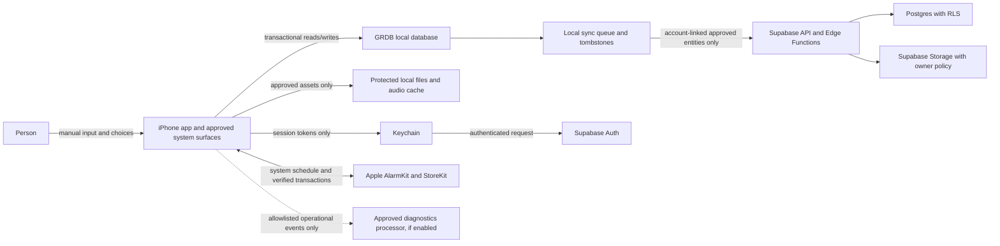

# Data Lifecycle and Sync Contract

**Contract ID:** `DATA-P1-001`  
**Status:** Complete proposed contract; Product, Privacy/Legal, Backend, and
Security approval pending  
**Updated:** 28 July 2026

### Selected Supabase test project

- Project reference: `nfzvlvukbeapcnlmyecf`
- Intended use: development/test evidence for approved account-scoped sync,
  Auth, RLS, Storage, export, and deletion behavior.
- Current evidence status: the repository-scoped `supabase_spc` MCP is
  OAuth-authenticated and returned
  `https://nfzvlvukbeapcnlmyecf.supabase.co`. Read-only inspection evidence is
  recorded in [`SUPA-P0-001`](./SUPABASE_LIVE_INSPECTION.md).
- The live project currently contains only `public.waitlist` in the public
  schema, has no recorded migrations, Edge Functions, Storage buckets, or Auth
  identities, and is not the approved Phase 1 synchronization schema. Satyam
  Shree confirmed that the table serves a separate live website; it is not an
  app data entity.
- Live inspection found anonymous read access to waitlist email rows,
  unrestricted anonymous inserts, broad current/default API-role privileges,
  and a public `SECURITY DEFINER` `rls_auto_enable()` function executable by
  `anon` and `authenticated`. The staged remediation is
  [`SUPA-P0-002`](./SUPABASE_WAITLIST_REMEDIATION_PLAN.md).
  Backend/Security approval is blocked until the website contract is verified
  and a versioned remediation passes isolation tests.
- Project region and Apple/Google provider configuration remain unverified
  because the available MCP tools do not expose those account settings.
- Authority boundary: OAuth access and read-only inspection do not authorize a
  remote migration or policy change. Region and provider configuration must be
  read from an authoritative account/dashboard surface rather than inferred.

## 1. Principles

1. The local GRDB database is the immediate source for user-visible core data.
2. Guest data does not leave the device.
3. An account exists only when the person chooses approved synchronization.
4. Synchronization is replication, not remote authority over an actively edited
   local screen.
5. Every collected field has one approved Phase 1 purpose.
6. No field is inferred from sensor, alarm, audio, playback, or app lifecycle
   activity.
7. Free text and wellness/check-in answers never enter analytics, logs,
   notifications, search indexes, crash breadcrumbs, support payloads, or AI.
8. Deletion is modeled as a lifecycle operation, not a hidden SQL side effect.
9. Phase 1 does not claim end-to-end encryption. It relies on iOS Data
   Protection, Keychain for tokens, TLS in transit, Supabase controls, RLS, and
   least privilege.

## 2. Trust boundaries and data flow



The dotted diagnostics flow does not exist until its provider, processing
terms, event schema, retention, region, deletion behavior, privacy disclosure,
and consent/legal basis are approved.

## 3. Entity inventory

### `DATA-PROFILE` — Local profile

| Field | Type | Sensitivity | Purpose | Remote |
|---|---|---|---|---|
| `id` | UUID | Pseudonymous | Own local rows | Mapped to account profile after conversion |
| `created_at` | UTC instant | Operational | Lifecycle/export | Yes after conversion |
| `onboarding_completed_at` | UTC instant | Operational | Launch routing | No |
| `product_notice_version` | bounded string | Operational | Notice routing | No |
| `product_notice_seen_at` | UTC instant | Operational | Avoid repeated notice | No |
| `account_user_id` | UUID nullable | Account | Link to authenticated owner | Local mapping; remote derives from auth |
| `account_link_state` | enum | Account/operational | Transactional conversion/recovery | No |

No name, age, gender, diagnosis, frequency, partner, voice, or contact field is
permitted.

### `DATA-SETTINGS` — App preferences

| Field | Type | Purpose | Sync |
|---|---|---|---|
| `preferred_grounding_asset_id` | catalog ID nullable | Start chosen approved local content | Yes |
| `preferred_modality` | `audio` / `visual` / `silent` | Accessibility/user preference | Yes |
| `haptics_enabled` | Boolean | Honor user choice | Yes if haptics approved |
| `last_selected_history_period` | bounded enum | UI convenience | No |
| `diagnostics_enabled` | Boolean | Store explicit optional telemetry choice if required | No |
| `updated_at`, `revision` | instant/integer | Deterministic sync | Yes for synced fields |

System accessibility settings are read at runtime, not copied into the profile
or analytics.

### `DATA-ALARM` — Alarm intent and reconciliation

| Field | Type | Sensitivity | Purpose | Sync |
|---|---|---|---|---|
| `id` | UUID | Operational | Stable local object | Yes |
| `system_alarm_id` | UUID/string nullable | Device | Reconcile AlarmKit object | No |
| `local_hour`, `local_minute` | bounded integers | Personal routine | Chosen time | Yes |
| `weekdays` | seven-bit mask | Personal routine | Recurrence | Yes |
| `snooze_minutes` | approved enum nullable | Personal routine | Approved snooze | Yes |
| `enabled_intent` | Boolean | Personal routine | Person's desired state | Yes |
| `system_state` | enum | Device | Honest UI | No; recalculate per device |
| `last_schedule_result` | coarse enum | Operational | Recovery | No |
| `created_at`, `updated_at`, `revision` | instant/integer | Operational | Lifecycle/sync | Yes |

Syncing an alarm preference does not silently schedule it on another device.
Each device requires its own authorization and explicit confirmation before
creating a system alarm.

### `DATA-CHECKIN` — Submitted entry

| Field | Type | Sensitivity | Purpose | Sync |
|---|---|---|---|---|
| `id` | UUID | Pseudonymous | Stable edit/delete/export | Yes |
| `reported_for_local_date` | ISO local date | Wellness | Organize user history | Yes |
| `reported_timezone_id` | IANA ID | Wellness context | Preserve the calendar meaning selected | Yes |
| `occurrence` | `yes` / `no` | Sensitive wellness | User-entered occurrence | Yes |
| `perceived_intensity` | `mild` / `moderate` / `severe` / `extreme` / null | Sensitive wellness | Optional subjective description | Yes |
| `present_state` | `fine_now` / `still_shaken` / `exhausted` / null | Sensitive wellness | Optional present self-description | Yes |
| `note` | normalized text ≤500 user-perceived characters / null | Highly sensitive free text | Person's private note | Yes |
| `created_at`, `updated_at` | UTC instant | Operational | Ordering/edit history | Yes |
| `revision` | monotonic integer | Operational | Conflict detection | Yes |
| `deleted_at` | UTC instant nullable | Operational | Tombstone/no resurrection | Yes while tombstone retained |

There is no computed risk, confidence, cause, trigger, outcome, improvement,
health classification, vector embedding, sentiment, tag extraction, or AI
field.

### `DATA-DRAFT` — Local check-in draft

Same user fields as `DATA-CHECKIN`, with nullable occurrence and a
`draft_updated_at`. It is local only, absent from History/export/sync, and
purged after the proposed seven-day inactivity period or immediately on local
data deletion.

### `DATA-AUDIO-MANIFEST` and `DATA-AUDIO-CACHE`

The manifest contains public catalog metadata, provenance, rights, version,
integrity hash, size, duration, locale, and approval references. The cache
contains approved audio bytes. Neither records listening history or a wellness
fact. See [Audio and offline contract](./AUDIO_AND_OFFLINE_CONTRACT.md).

### `DATA-ACCOUNT` — Optional identity/session

Supabase Auth owns account identifiers and authentication factors. Phase 1
offers Sign in with Apple and Sign in with Google only. Email/password,
passwordless email, phone, and OTP login are excluded. Guest use never requires
an account. The app may hold:

- Supabase user ID;
- display-safe masked account identifier when needed;
- session/access/refresh tokens in Keychain;
- authentication method;
- token expiry and reauthentication state; and
- account deletion request status.

Tokens, full auth payloads, email addresses, provider authorization codes, and
signed links do not enter GRDB logs, diagnostics, export, notifications, or
crash reports. Provider identifiers are handled by the auth service. Account
deletion revokes Supabase
sessions, Sign in with Apple tokens when applicable, and any retained Google
authorization grant or token that the approved implementation can revoke.

### `DATA-SYNC`

| Field | Purpose |
|---|---|
| `operation_id` | Idempotency |
| `entity_type`, `entity_id` | Route approved entity without content in logs |
| `operation` (`upsert`/`delete`) | Explicit mutation |
| `base_revision`, `local_revision` | Detect conflict |
| `state` | `pending`, `syncing`, `synced`, `conflicted`, `failed`, `deleted` |
| `attempt_count`, `next_attempt_at` | Bounded retry |
| `last_error_category` | Coarse recovery; no payload/content |
| `created_at`, `updated_at` | Lifecycle/retention |

Payload content remains in the entity table and is read transactionally; do not
duplicate the free-text note in queue logs.

### `DATA-COMMERCE`

Local commerce state contains only RevenueCat customer-information and Apple
product/transaction facts needed to render trial, subscription, lifetime,
known-expiration reminder, inactive, and utility-free access.
Never store payment-card data. Do not copy raw signed transaction payloads into
analytics or ordinary logs.

### `DATA-DIAGNOSTICS`

No general analytics schema is allowed. If diagnostics is approved, only the
allowlist in §9 may leave the device. It uses a random installation diagnostics
ID, not Supabase user ID, email, profile ID, check-in ID, alarm time, note, or
Apple transaction ID. The ID rotates on **Delete local app data** and is not
restored from sync.

## 4. Flow register

| ID | Flow | Data and rule |
|---|---|---|
| `FLOW-001` | First-use profile creation | On-device GRDB transaction only; no network |
| `FLOW-002` | Alarm scheduling | Local intent → AlarmKit/system; neutral system presentation; no backend required |
| `FLOW-003` | Manual grounding | System action → launch router → local entitlement/policy → verified bundled/cache asset; no experience record |
| `FLOW-004` | Check-in | Manual UI → local draft → explicit Save → local submitted row |
| `FLOW-005` | History | Local submitted rows → descriptive view; no remote computation |
| `FLOW-006` | Account conversion | Explicit sync choice → Auth → conversion transaction → queue → RLS-protected remote rows |
| `FLOW-007` | Ongoing sync | Local committed revision → idempotent queue → authenticated RLS API → acknowledgment |
| `FLOW-008` | Optional audio | Public approved manifest → short-lived authorized download URL → temp file → hash verification → atomic cache install |
| `FLOW-009` | Commerce | App ↔ RevenueCat Purchases SDK ↔ StoreKit; active `premium_access` → local access state; no Sleep Paralysis Companion account required |
| `FLOW-010` | Expiration reminder | Known nonrenewing store expiration → local once-daily in-app reminder during final 72 hours; no push/local notification approved |
| `FLOW-011` | Export | Local/reconciled data → temporary protected archive → user-selected share destination → cleanup |
| `FLOW-012` | Local deletion | Confirmation → transactional deletion/cleanup coordinator → first-use state |
| `FLOW-013` | Account deletion | In-app request → reauth → server deletion workflow → status/completion → local disposition |
| `FLOW-014` | Diagnostics | Approved coarse event → optional diagnostics processor; disabled until explicit approval |

## 5. Guest-to-account lifecycle

### 5.1 Preconditions

- The person opens Sync settings and sees the exact synchronized entity list.
- Network is available.
- Authentication completes.
- No conversion for a different account is already in progress.
- Local database is healthy and a rollback snapshot/transaction is possible.

### 5.2 New empty account

1. Set local link state to `conversion_preparing`.
2. Ask the server to create an idempotent conversion ID bound to authenticated
   user and installation.
3. Upload profile mapping, approved settings, alarm preference, and submitted
   check-ins in one resumable logical transaction.
4. Server validates schema, ownership, revisions, field constraints, and RLS.
5. Server commits and returns entity revisions.
6. Local transaction records account mapping and acknowledgments.
7. State becomes `account_linked`.

If any step before server commit fails, the local profile remains
`guest_local`. If server commit succeeds but local acknowledgment fails, retry
with the same conversion ID and reconcile; never duplicate rows.

### 5.3 Existing account with remote data

No scalar/profile setting is silently overwritten. Show a privacy-safe summary:

- count of local submitted entries;
- count of remote submitted entries;
- whether alarm/settings differ; and
- last remote sync time.

Offer:

1. **Keep both histories; use this device's alarm/preferences.**
2. **Keep both histories; use account alarm/preferences.**
3. **Cancel and stay local.**

Satyam Shree approved this choice set on 25 July 2026. Histories use union by
stable ID. A same-ID/same-content row deduplicates. A same-ID/different-content
collision preserves both by assigning the local row a new ID and recording a
non-sensitive collision audit. It never chooses by timestamp alone.

### 5.4 Conversion cancellation

Before server commit, cancel/timeout rolls back fully. After server commit,
cancel is no longer offered; the app completes local reconciliation or shows a
recoverable linked state. Account deletion, not a partial unlink, reverses
remote ownership.

## 6. Ongoing synchronization

### 6.1 State machine

```text
local commit → pending → syncing → synced
                         ├→ failed → pending (bounded backoff/manual retry)
                         └→ conflicted → resolved local commit → pending
local delete → deleted/pending tombstone → syncing → server acknowledged
```

Only a committed local transaction creates a queue operation. Network callbacks
may not mutate view state directly; they reconcile through the database.

### 6.2 Conflict rules

| Entity | Deterministic rule |
|---|---|
| Profile mapping | Server-authenticated account ownership controls; cross-account mapping is rejected |
| Onboarding notice fields | Local device only; never conflict |
| Alarm preference | If concurrent revisions differ, require explicit “Use this device” or “Use account” choice; system alarm remains device-local |
| Grounding preference | Same explicit choice during initial conversion; afterward reject stale base revision and show conflict |
| Check-in | Different IDs union; same ID and same content dedupe; same ID concurrent edit preserves both revisions and asks which to keep |
| Check-in delete vs edit | Delete wins only when its base revision includes the edited revision; otherwise conflict requires explicit keep/delete |
| Draft | Never synced |
| Audio cache/manifest | Cache is device-local; catalog version is server/content authority, never a user-data conflict |
| Entitlement | Active RevenueCat `premium_access` backed by Apple controls; never granted through Supabase profile |

No entity uses undocumented last-write-wins. Device wall-clock ordering is not
conflict authority.

### 6.3 Retry

- exponential backoff with jitter and a documented cap;
- one in-flight operation per entity;
- idempotency key for every remote mutation;
- automatic pause on authentication error;
- no retry of validation/authorization failure until the underlying state
  changes;
- manual Retry triggers the same idempotent operation; and
- queue/error logs contain identifiers/categories, never note text or full
  payload.

## 7. Sign-out, reinstall, token expiry, and account change

| Event | Required result |
|---|---|
| Token expires online | Local core continues; sync pauses `auth_required`; reauthentication is nonblocking |
| Token expires offline | Same; do not erase or expose data |
| Sign out with no pending work | Ask **Keep protected local copy** or **Remove account data from this device**; explain both |
| Sign out with pending work | Require Sync now, Keep locally and sign out, or Cancel; never discard silently |
| Keep local copy after sign-out | Data remains cryptographically protected by iOS but is marked bound to the former account and cannot be claimed by another account without reauth/approved conversion |
| Remove from device | Delete account-bound local rows/tokens/queue/cache as specified; remote account remains |
| Different account signs in | Never show former-account data; require former-account reauth or removal before conversion |
| Reinstall as guest | App cannot recover deleted local guest data |
| Reinstall then sign in | Download approved account data only after authentication and local-empty confirmation; device alarm scheduling still requires local authorization/action |
| StoreKit restore | Independent of Supabase account; use Apple Account/verified transactions |

Satyam Shree approved these sign-out choices on 25 July 2026. Physical
Data-Protection and cross-account-isolation tests remain required.

## 8. Retention and deletion schedule

Satyam Shree approved the following Phase 1 defaults on 25 July 2026. “Until
user deletes” still requires a visible deletion route. Final policy wording
must disclose any legally required exception.

| ID | Data | Local retention | Remote retention | Deletion behavior |
|---|---|---|---|---|
| `RET-001` | Local profile/settings | Until Delete local data | Until account deletion when synced | Transactional local removal; account workflow for remote |
| `RET-002` | Alarm intent | Until alarm removed or local deletion | Until alarm preference removed/account deletion | Remove app-created system alarm and local row; remote tombstone |
| `RET-003` | Submitted check-ins/notes | Until individual/local deletion | Until individual/account deletion | Hide locally immediately; authenticated tombstone prevents resurrection |
| `RET-004` | Draft check-in | 7 days after last edit | Never | Purge on expiry, submit, abandon-delete, or local deletion |
| `RET-005` | Sync operation metadata | 7 days after success; failures until resolved or 30 days | Server idempotency record 30 days | Purge without entity content |
| `RET-006` | Deletion tombstone | Until every known target acknowledges, then 30 days | 30 days after acknowledgment | Final purge must not permit resurrection |
| `RET-007` | Bundled audio | App lifetime | N/A | Removed with app only |
| `RET-008` | Downloaded audio/cache | Until user removal, catalog revocation, integrity failure, or storage eviction | Source object per licensed catalog lifecycle | Minimum bundle never evicted; cache removal has no user-history effect |
| `RET-009` | Auth tokens | Active session | Auth provider policy | Keychain removal on sign-out/local deletion; server revoke on account deletion |
| `RET-011` | RevenueCat/StoreKit entitlement cache | While needed to render trustworthy access; refresh on customer-information/transaction updates | RevenueCat over Apple authority | No payment-card data or secret key; local reset does not cancel transaction |
| `RET-012` | Operational diagnostics | Not collected in Phase 1 until a separately approved provider/configuration exists | Not collected | Diagnostics remain off |
| `RET-013` | Temporary export | Until share completion/cancel, maximum 24 hours after interrupted flow | Never, unless user chooses a remote destination outside Sleep Paralysis Companion | Protected temp cleanup on launch/background task |
| `RET-014` | Account deletion audit | No local record after completion | Minimal request ID, completion timestamp, and outcome for 30 days; no content or direct account identifier | Purge at 30 days unless a documented legal hold applies |

## 9. Operational diagnostics allowlist

Diagnostics are `OFF` until an owner approves a processor and this exact
schema. No event records check-in existence or value, alarm time, audio title,
or the fact that a manual action was used for an episode.

| Event ID | Event | Allowed properties |
|---|---|---|
| `DIAG-001` | `app_start_result` | app version, OS major/minor, coarse device class, result category |
| `DIAG-002` | `alarm_operation_result` | operation category, framework path, authorization category, result/error category; no schedule/time |
| `DIAG-003` | `system_entry_result` | surface category, lifecycle category, result/error category; no episode/check-in fact |
| `DIAG-004` | `audio_operation_result` | bundled/downloaded category, operation, result/error category; no private note or listening history |
| `DIAG-005` | `sync_operation_result` | entity category, operation, result/error category, retry bucket; no entity ID/content/count tied to account |
| `DIAG-006` | `purchase_operation_result` | product-duration category, purchase/restore/manage, result category; no transaction/account ID |
| `DIAG-007` | `export_delete_result` | local/account/entry category and result; no field/count/content |

Not allowed:

- screen-view trails around grounding/check-in/history;
- free text, wellness answer, selected date, alarm time, playback duration, or
  content title;
- account/profile/check-in/alarm/transaction identifiers;
- advertising identifiers, device fingerprint, precise locale/location, IP
  enrichment, contacts, or attribution;
- session replay, heatmaps, keystroke capture, or automatic screenshots;
- marketing audience creation or cross-app linkage; or
- remote feature experiments affecting claims, fields, deletion, or commercial
  access without change control.

Crash diagnostics must use the same redaction boundary. The privacy manifest,
App Store privacy answers, policy, processor contract, and observed traffic must
agree.

## 10. Export contract

### Local guest export

Create a protected ZIP containing:

- `manifest.json`: export version, app version, generated UTC instant, local
  profile creation instant, policy versions, included file hashes;
- `settings.json`: approved user preferences;
- `alarm.json`: chosen alarm preference and last known system-state category,
  clearly distinguished;
- `checkins.json`: all submitted nondeleted entries with exact enums and
  timestamps; and
- `checkins.csv`: human-readable equivalent using localized headers and
  unambiguous raw enum codes.

Exclude tokens, auth payloads, queue internals, tombstones, diagnostics IDs,
StoreKit transaction payloads, copyrighted audio, cache,
and abandoned drafts.

### Account export

When online, reconcile sync or clearly state a cutoff. The manifest must say
whether it is:

- local-only;
- last-synced local snapshot; or
- server-reconciled account export.

Never label an incomplete local snapshot as “all account data.” Export remains
available without premium entitlement.

## 11. Deletion contracts

### Individual entry

After confirmation:

1. local transaction marks a tombstone and removes it from ordinary queries;
2. any draft/edit state is cleared;
3. account-linked deletion queues idempotently;
4. remote acknowledgment advances retention; and
5. retry/conflict cannot resurrect the entry.

### Delete local app data

Coordinator removes:

- app-created AlarmKit/system alarm objects;
- GRDB profile, settings, alarm, entries, drafts, queues, and tombstones;
- app-group/extension state;
- downloaded audio and temp/export files;
- account tokens and session metadata;
- diagnostics identifier/queued diagnostics; and
- cached entitlement presentation state.

It does not claim to cancel an Apple subscription or delete a remote account.
If account-linked, confirmation makes that separation explicit.

### Delete account

The in-app flow:

1. is easy to find;
2. explains remote/local scope and Apple subscription consequences;
3. reauthenticates and confirms intent without unnecessary friction;
4. allows immediate account deletion even when a subscription remains active;
5. revokes sessions and applicable Apple/Google authorization tokens or grants;
6. deletes all non-legally-retained remote rows/objects;
7. reports a proposed maximum completion period of seven days, subject to
   Legal/Backend approval;
8. gives status and completion notice;
9. identifies any legally retained minimal data, purpose, and expiry; and
10. applies the person's explicit local-data choice.

Support email/call is not a mandatory gate. Failure or interruption is
idempotently recoverable.

## 12. Supabase authorization contract

- Every user-owned table has RLS enabled before any data exists.
- `auth.uid()` must match the immutable owner column for select/insert/update/
  delete.
- Client input cannot set/change owner to another user.
- Storage object paths and policies bind to the authenticated owner; signed
  URLs are short-lived and never logged.
- Guest/anonymous access cannot read or write user tables or objects.
- Service-role credentials exist only in controlled server environments.
- Edge Functions validate auth, schema, allowed fields, sizes, revisions,
  idempotency, and rate limits.
- Positive owner, negative other-user, anonymous, expired-token, forged-owner,
  over-posted-field, replay, and deleted-account cases have automated policy
  tests.
- Development/staging/production use separate projects/credentials and cannot
  cross-resolve.
- Admin/support access to sensitive rows is disabled by default and, if ever
  added, requires separate approved least-privilege audit controls.

## 13. Approval blockers

Product/lifecycle defaults are owner-approved. Gate 0 still requires:

- versioned Supabase schema, Auth configuration, RLS/storage policies, and
  positive/negative isolation/deletion test evidence;
- Apple/Google callbacks, provider-link/collision, reauthentication,
  cancellation, expiry/revocation, and account-deletion evidence;
- physical Data Protection, sign-out, reinstall, and cross-account evidence;
- final approved privacy/legal wording aligned with `PRIV-P0-001`,
  `PRIV-P1-002`, and `LEGAL-P1-003`; and
- a separate approval before any diagnostics provider or event collection is
  enabled.
