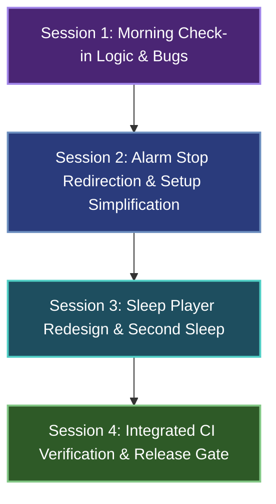

# Client Updates (Meeting Sep 3, 2026) — Orchestration & Session Index

> **Created 04 September 2026.** Based on the founder & client meeting on 3 September 2026 at 16:19 IST (Shraddha Rakshe & Satyam Shree).
> Target release: **Upload final application build to App Store tomorrow**.

---

## 1. Context & Objectives

During the September 3, 2026 meeting, the client finalized critical user flow changes, resolved navigation ambiguity, and prioritized immediate bug fixes before the impending App Store release:

1. **Alarm Screen Behavior:** Tapping "Stop" must transition directly to the Morning Check-in flow rather than lingering on the alarm screen. "Stop" and "Snooze" buttons remain.
2. **Morning Check-in Flow & Matrix Logic:**
   - Fix bug preventing morning check-in from saving.
   - Fix bug where skipping check-in displays an error message regarding saved answers.
   - Correct matrix branching logic: if user indicates **NO** episode, skip two follow-up questions and show only **2 questions total** (Episode occurrence → Did SPC help you fall asleep?).
   - Update moon stage progress indicators in header to reflect the active branch (2-step vs. 4-step).
3. **Alarm Setup Simplification & Navigation:**
   - Simplify the alarm creation/editing layout to reduce user cognitive load (clear time/date presentation, remove overwhelming elements).
   - Centralize schedule navigation onto the homepage.
4. **Sleep Player vs. "Second Sleep" Separation:**
   - Clearly delineate:
     - **Sleep Player:** Initial bedtime routine to calm down before sleep (accessed via "Calm Your Mind" or automatically started after saving an alarm).
     - **Second Sleep:** Post-episode recovery for users waking up after sleep paralysis.
   - Restructure Sleep Player:
     - Remove hero vector illustration (`SleepSessionMoon`).
     - Place direct access to audio tracks at the top.
     - Vertically scrollable container to support downloadable audio tracks with download buttons.
     - Provide two core tracks: **"Quick Unwind" (15 min)** and **"Slow Unwind" (1 hr 15 min)**.
     - Maintain consistent calming background imagery across tracks (no unique per-track PNG artwork needed).
     - Retain grounding quick action and audio fade-away timer.
   - Second Sleep Screen:
     - Retain a single, large Call-to-Action (CTA) button for high usability under post-episode cognitive disorientation.
     - Document and respect iOS Face ID security constraints for actions from locked state.
5. **App Store Release & CI Pipeline Verification:**
   - Clean, green pipeline across `phase-1-integrated-app.yml` on GitHub Actions (`macos-26`).
   - Capture updated 36+ checkpoints visual journey (`scripts/visual_journey.sh`).

---

## 2. Session Index

Each prompt below is an independent, self-contained operating contract designed to be executed in its own fresh agent session.

| Phase | Prompt File | Core Objectives | Priority | Target Branch |
|---|---|---|---|---|
| **S1** | [`PROMPT_S1_MORNING_CHECKIN_MATRIX_AND_BUGS.md`](./PROMPT_S1_MORNING_CHECKIN_MATRIX_AND_BUGS.md) | Fix check-in save bug; fix skip error alert; correct 2-question vs 4-question matrix logic; dynamic moon stages. | 🔴 Blocker | `fix/morning-checkin-matrix-and-bugs` |
| **S2** | [`PROMPT_S2_ALARM_STOP_FLOW_AND_SETUP_SIMPLIFICATION.md`](./PROMPT_S2_ALARM_STOP_FLOW_AND_SETUP_SIMPLIFICATION.md) | Alarm post-stop redirection to Morning Check; simplify alarm setup layout; homepage navigation consolidation. | 🔴 High | `feat/alarm-stop-flow-and-setup-simplification` |
| **S3** | [`PROMPT_S3_SLEEP_PLAYER_REDESIGN_AND_SECOND_SLEEP.md`](./PROMPT_S3_SLEEP_PLAYER_REDESIGN_AND_SECOND_SLEEP.md) | Decouple Sleep Player from Second Sleep; remove hero vector; vertical scrollable audio container; Quick/Slow Unwind; auto-start on alarm save. | 🔴 High | `feat/sleep-player-redesign-and-second-sleep` |
| **S4** | [`PROMPT_S4_INTEGRATED_VALIDATION_CI_AND_RELEASE.md`](./PROMPT_S4_INTEGRATED_VALIDATION_CI_AND_RELEASE.md) | Run full hosted CI battery; visual journey capture; TestFlight preflight checks; generate release report. | 🟡 Release Gate | `release/app-store-candidate` |

---

## 3. Recommended Execution Order & Dependency Graph



### Why this order?
1. **S1 first:** Because Session 2 modifies the alarm stop flow to redirect directly into Morning Check-in. If Morning Check-in has save errors, skip errors, or broken matrix logic, the alarm transition cannot be verified end-to-end.
2. **S2 second:** Once Morning Check-in is robust, wire the alarm stop button to route seamlessly into Morning Check-in, and streamline the alarm setup editor.
3. **S3 third:** Modernizes the Sleep Player into a vertical scrollable list with Quick/Slow Unwind, removes the hero vector, separates it cleanly from Second Sleep, and wires alarm save auto-start.
4. **S4 last:** Verifies all 3 changes together through the full hosted macOS-26 CI battery, captures the visual journey MP4, and produces the App Store release artifact.

---

## 4. Conflict-Control & Working Rules

- **Strict File Ownership:** Each prompt specifies **Files you own** and **Do not touch**. Never edit files outside your assigned boundary.
- **Hosted Mac Verification:** The developer workstation is Windows. Build, test, and lint verifications run exclusively via GitHub Actions runners (`macos-26`).
- **Swift 6 Concurrency:** The project enforces `SWIFT_STRICT_CONCURRENCY = complete` and `SWIFT_DEFAULT_ACTOR_ISOLATION = MainActor`. Non-actor models must be explicitly marked `nonisolated` and conform to `Sendable`.
- **CI Verification Tools:**
  ```bash
  # Check status of recent runs
  gh run list --workflow phase-1-integrated-app.yml --limit 5
  # Live watch the active run
  gh run watch <run-id> --exit-status
  # View failed step logs
  gh run view <run-id> --log-failed
  # Manually trigger workflow
  gh workflow run phase-1-integrated-app.yml --ref <branch>
  ```
